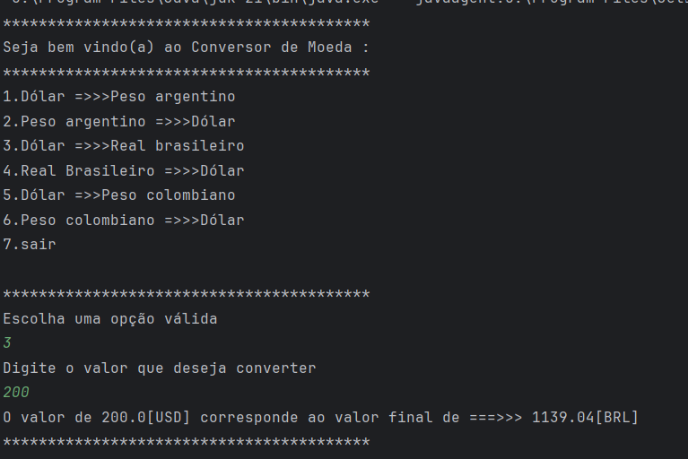

# Conversor de Moedas



## Descrição

O **Conversor de Moedas** é uma aplicação Java que permite converter valores entre diferentes moedas de forma prática e interativa pelo terminal. Utilizando a API pública ExchangeRate, o sistema realiza consultas em tempo real e exibe o resultado da conversão com base na taxa de câmbio atual.

Este projeto foi desenvolvido com foco em:
- Consumo de APIs públicas,
- Tratamento seguro de entrada de dados,
- Organização do código em pacotes,
- Uso de bibliotecas externas como o [Gson](https://github.com/google/gson) para manipulação de JSON.

---

## Funcionalidades

- 🖥️ Interface pelo terminal, simples e intuitiva
- 🔄 Conversão de moedas em tempo real utilizando [ExchangeRate-API](https://www.exchangerate-api.com/)
- 👤 Interação direta com o usuário
- 📊 Exibição clara e objetiva dos valores convertidos

---

## Tecnologias Utilizadas


---

## Como Baixar e Executar o Projeto

1. **Clone o repositório**
    ```bash
    git clone https://github.com/izgpbela/ConversordeMoedas---One.git
    ```
2. **Acesse a pasta do projeto**
    ```bash
    cd ConversordeMoedas---One
    ```
3. **Baixe a biblioteca Gson**
    - Você pode baixar a biblioteca [Gson](https://mvnrepository.com/artifact/com.google.code.gson/gson) pelo Maven, Gradle ou manualmente.

4. **Compile e execute o projeto**
    - Certifique-se de que o Java 21 (ou superior) está instalado.
    - Compile os arquivos `.java` e execute a aplicação pelo terminal.
    - Exemplo:
        ```bash
        javac -cp gson-<versao>.jar src/*.java
        java -cp .;gson-<versao>.jar src/NomeDaClassePrincipal
        ```

---

## Observações

- O projeto está em desenvolvimento. Novas funcionalidades podem ser adicionadas em breve!
- Para utilizar a API ExchangeRate, pode ser necessário obter uma chave gratuita no site oficial.
- Contribuições, feedbacks e sugestões são bem-vindos!

---

## Licença

Este projeto está sob a licença MIT. Consulte o arquivo [LICENSE](LICENSE) para mais detalhes.

---

## Autor

- [izgpbela](https://github.com/izgpbela)
